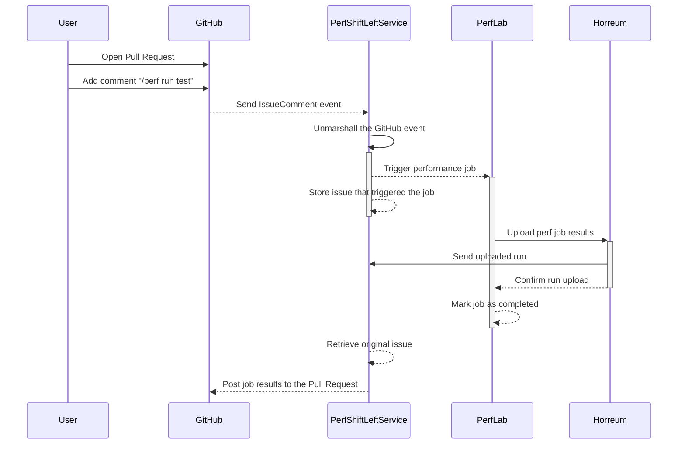

# Interactions

## Run test
The following sequence diagram shows an example of interactions from the PR creation to
the performance job result posting to the same PR.

**Actors**

* **PerfShiftLeftService**: GitHub App that manages the interaction with GitHub itself.
Its main objective is to interpret the GitHub events and properly trigger the corresponding
performance job. After that it implements a Horreum webhook to get notified when the results
are uploaded so that it can post the results back to the original pull request.
* **PerfLab**: Where the actual performance jobs will run, initially this could be a Jenkins instance
* **Horreum**: Here Horreum is used as backend datastore for performance jobs results

## Compare runs

TBD