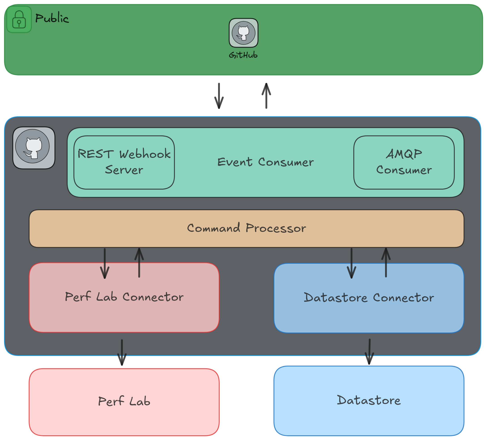

# Performance Bot Integration 

## Authors

- Andrea Lamparelli

## Motivation

This proposal aims to empower development teams by tightly integrating performance testing into their daily workflow. 
The current model, where performance validation occurs late in the release cycle, creates a disconnect and often results 
in unforeseen issues and urgent fixes. By enabling repositories to directly trigger performance tests from commits 
and/or pull requests, we are bringing performance analysis closer to the developer. This 'shift-left' approach will 
make it significantly easier and faster to pinpoint the exact changes that introduce performance regressions, 
streamlining the development process and preventing performance-related problems from ever reaching production.

## High-Level Architecture

To achieve this integration, we propose to develop a modular and extensible infrastructure that serves as an agnostic 
middleware. This system will function as a central communication bridge between source code repositories and various 
performance testing environments.

The core of this middleware will be a standardized API that decouples the repositories from the specific lab 
implementations. 

Its primary responsibilities will include:

1. Receiving webhook events from repositories.
2. Translating these events into API calls to trigger the appropriate test pipelines in a configured performance lab.
3. Integrates with external datastore to monitor performance test results.
4. Retrieving and formatting the performance results to be reported back to the original pull request.
5. This pluggable architecture ensures we can easily add support for new labs or source control systems by simply 
developing a new connector, without altering the core logic.

## Goals

The primary goal of perf-bot is to automate the detection, isolation, and triage of performance regressions within the 
CI/CD lifecycle. This addresses the significant manual effort currently required by performance engineers to pinpoint 
the exact source of a performance degradation when it is discovered in batched builds (e.g., nightly or weekly).

The key objectives are:
* **Improve developer velocity**: To significantly reduce the time it takes to diagnose performance issues, allowing 
developers to address them faster and preventing regressions from impacting users.

* **Seamless CI/CD integration**: To function as an autonomous "bot" that integrates naturally into the GitHub workflows. 
It should be triggerable by developer actions (e.g., pull request comments) and report its findings back to the same context.

* **Shift left perf results**: Guarantee that benchmark results are pushed back to the same context that triggered the 
benchmark, so that developers can directly see performance results without switching to different sources.

* **Extensibility**: To create a flexible framework that is not tied to a single lab environment. The system must be easily 
extendable to support different underlying tech stacks.

## Architecture

TBD architecture in the first implementation (coupled with GitHub, Jenkins and Horreum)

### Integration with repositories

Integration will be managed through a GitHub App and repository-level configuration, providing a secure and flexible model.

* GitHub App: A dedicated perf-bot GitHub App will be created. Repository owners will install this app to grant the 
service the necessary permissions (e.g., read code, post comments, update PR status checks). This is more secure and 
manageable than using PAT (personal access tokens).

* Triggering mechanism: The primary trigger will be a GitHub Webhook that can be configured directly in the GitHub App
configuration, in the case the `perf-bot` will run in the public, or using GitHub webhooks configuration otherwise. In 
the latter case owners will have to take care of ensuring the Webhook events are forwarded to the running `perf-bot` instance.

* Configuration: A configuration file will allow teams to define which benchmarks to run, and provide other benchmark-specific 
parameters. This empowers teams to manage their own performance testing configuration and decide what to expose and what not.

### Multi tenancy

The system will be designed on a *single-tenant* model, where each repository wishing to use the service will deploy 
its own dedicated `perf-bot` instance. This approach prioritizes maximum security and isolation.

* **Data isolation**: By deploying a separate instance for each repository, all data, including source code, benchmark 
results, and intermediate artifacts, is completely isolated. There is no risk of data leakage between different projects
or teams.

* **Repository-specific credentials**: This model empowers repository owners to maintain full control over their security 
credentials. They can create and manage their own GitHub App and associated secrets, ensuring that the bot's permissions 
are scoped exclusively to their repository and that they control the entire lifecycle of the credentials.

* Customized environments: Each instance can be configured with a specific execution environment (e.g., Jenkins), 
results storage (e.g., Horreum) tailored to the needs of that single repository, avoiding any "noisy neighbor" problems 
from other tenants.

## Alternatives

TBD