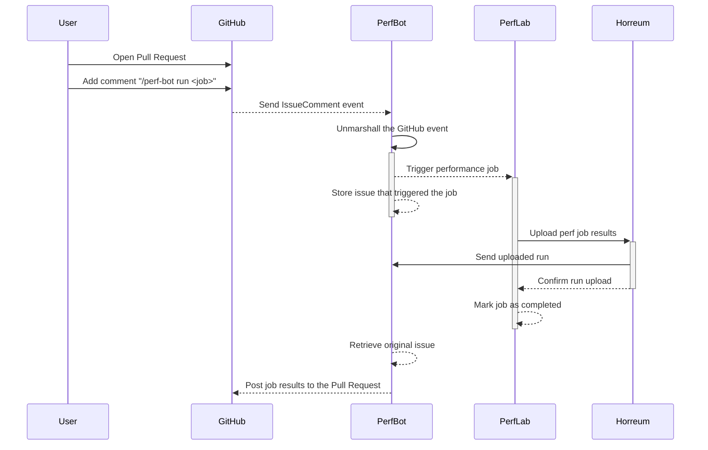

# Architecture

This document outlines the architecture of the Perf Bot as well as the workflows for automated performance testing 
within a generic environment, utilizing the Perf Bot itself. 

Perf Bot is a [GitHub App](https://docs.github.com/en/apps/using-github-apps/about-using-github-apps) 
orchestrates the process, triggering performance jobs, collecting results, and providing feedback on pull requests. 
The current workflows detail the interactions between users, GitHub, Perf Bot, Perf Lab (the execution environment,
where the jobs are running), and Horreum (the data storage, where results are stored and tracked for further analysis).

## About

This section details the architecture of Perf Bot, its position among related performance lab components, 
and its specific mechanisms for integrating with GitHub.

TODO

## Workflows

This section provides a comprehensive overview of the different workflows facilitated by Perf Bot. 
It outlines the various scenarios and trigger events that initiate performance jobs, detailing how Perf Bot 
interacts with GitHub, Perf Lab, and Horreum to execute, store, and report on performance test results. 
Each workflow demonstrates Perf Bot's capability to automate and streamline performance testing as part of 
the development lifecycle.

Here a list of the main actors that will be involved in the following diagrams:

* **GitHub**: A cloud-based platform where you can store, share, and work together with others to write code
* **PerfBot**: The GitHub App that manages the interaction with GitHub itself (this repository). It 
  interprets the GitHub events and execute the requested command.
* **PerfLab**: Where the actual performance jobs will run, e.g., Jenkins or ArgoCD
* **Horreum**: Horreum is used as backend datastore for performance jobs results

### Run a Performance Job from GitHub

This section details the Perf Bot workflow for triggering performance jobs via pull requests.

TODO: add some description/comments and examples